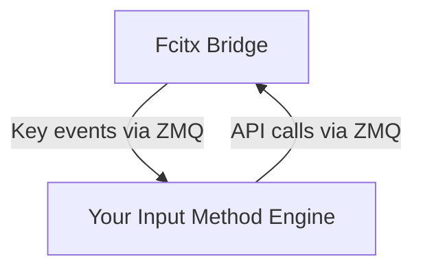

## Why this library?

Fcitx5 is the de-facto input method platform for Linux. It's written in C++ and that means, the most straight-forward way to implement your own input method engine is using C++. However, not everyone wants to do that. This project provides an opportunity to implement an input method engine in any languages, and communicate to Fcitx5 using ZMQ and Protobuffer.

## How to use?

fcitx-bridge is implemented as a place-holder input method engine, that takes key events from Fcitx5 and [publishes](https://zeromq.org/socket-api/#publish-subscribe-pattern) the events encoded using Protobuffer. Your input method engine listens to these events and computes the candidate words and send it to fcitx-bridge. The proto [file](https://github.com/qingxiang-jia/fcitx5-bridge/blob/main/msgs.proto) shows what's API calls are supported.

## How to build and run?

You need the ZMQ package for the Linux distribution you use. After that, take a look at the [Makefile](https://github.com/qingxiang-jia/fcitx5-bridge/blob/main/Makefile) to see what's possible.

Once you are able to build it, install it and add "Bridge for Fcitx" as an input method. Now, your input method engine can listen to the event and send Protobuf messages to it.

## Projects rely on this

Full Cloud Pinyin: https://github.com/qingxiang-jia/full-cloud-pinyin